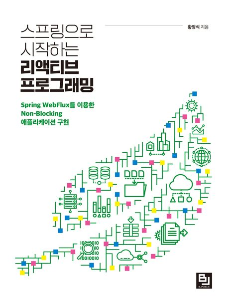

> [!IMPORTANT]
> 모든 마크다운 파일은 직접 본인이 작성하였습니다.

# 🌊 Spring WebFlux 학습 정리

---

## 1. 🚀 Spring Reactive Web Applications 개요

상세 내용 보기

- 💫 [리액티브 시스템과 리액티브 프로그래밍의 의미](./md/리액티브%20시스템과%20리액티브%20프로그래밍의%20의미.md)
- 🔄 [Blocking I/O 방식과 Non-Blocking I/O 방식 이해하기(1)](./md/블로킹,논블로킹%20IO%20이해하기.md)
- ⚡ [Blocking I/O 방식과 Non-Blocking I/O 방식 이해하기(2): Spring MVC vs Spring WebFlux](./md/블로킹,논블로킹%20IO%20이해하기.md)
- 📚 [Spring WebFlux 개요](./md/Spring%20WebFlux%20개요.md)

## 2. ⚛️ Project Reactor 개요

상세 내용 보기

- 🔮 [리액터(Reactor) 란?](./md/what-is-reactor.md)
- 🔮 [리액터(Reactor) 용어 정의](./md/reactor용어정의.md)

## 3. 📊 마블 다이어그램 이해

상세 내용 보기

- 🔮 [마블 다이어그램 이해하기](./md/marble-diagram.md)

## 4. 🔄 콜드 시퀀스를 핫 시퀀스로 변환하기

상세 내용 보기

- 🔮 [콜드 시퀀스를 핫 시퀀스로 변환하기](./md/Cold-Hot%20Sequence.md)

## 5. 🔙 백프레셔

상세 내용 보기

- 🔮 [백프레셔](./md/백프레셔.md)

## 6. 📥 Sinks

상세 내용 보기

- 🔮 [Sinks](./md/sinks.md)

## 7. ♻️ Scheduler

상세 내용 보기

- 🔮 [Scheduler](./md/Scheduler.md)

## 8. 🏳️ Context

상세 내용 보기

- 🔮 [Context](./md/Context.md)

## 9. 🔄 Operator API

상세 내용 보기

- 🔮 [생성형 Operator](./md/Create.md)
- 🔮 [필터형 Operator](./md/Filter.md)
- 🔮 [변환형 Operator](./md/Transform.md)
- 🔮 [sequence 분리](./md/sequenceSeperate.md)
- 🔮 [멀티캐스팅](./md/multicasting.md)

---

### 📖 참고 자료
- [Spring WebFlux 공식 문서](https://docs.spring.io/spring-framework/reference/web/webflux.html)
- [Project Reactor 공식 문서](https://projectreactor.io/docs)

### 📖 참고 서적
- 리액티브 프로그래밍 입문

> [!NOTE]
> 이 문서는 지속적으로 업데이트됩니다.
> **모든 마크다운 파일은 직접 본인이 작성하였습니다.**

> [!TIP]
> 각 섹션의 제목을 클릭하면 상세 내용을 확인할 수 있습니다.