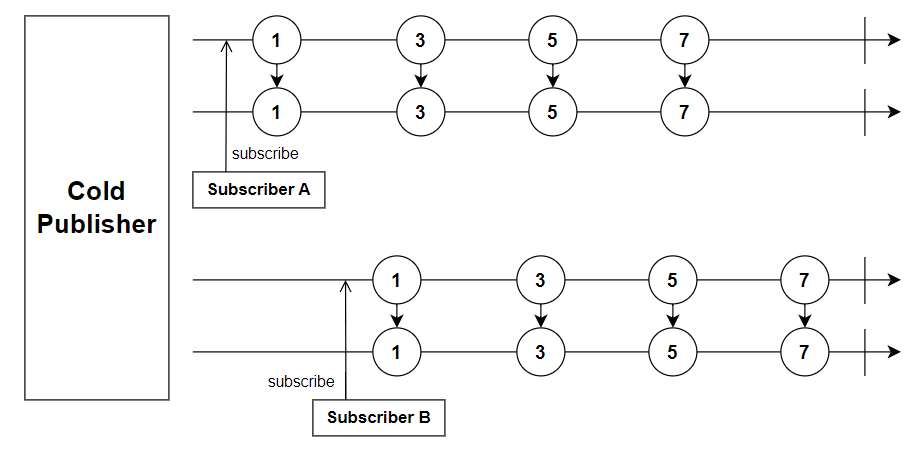
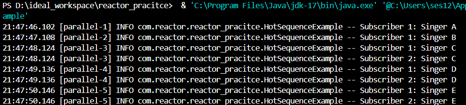

# Cold & Hot Sequence 🛠️

**콜드 시퀀스**와 **핫 시퀀스**는 리액티브 프로그래밍에서 데이터 스트림의 동작 방식을 설명하는 데 사용되는 두 가지 개념입니다.

---

## 1. 콜드 시퀀스 🎨
- **독립적인 타임라인**: 각 subscriber마다 새로운 시퀀스를 생성하며 타임라인을 공유하지 않음.
- 구독 시 데이터 스트림이 **처음부터 시작**.
- 대표적인 예: `Flux.range`, `Flux.fromIterable` 등의 리액티브 소스.
- **특징**:
  - 데이터를 방출하는 producer가 구독 시 새롭게 시작.
  - subscriber 수에 따라 동일한 데이터가 여러 번 생성될 수 있음.

---

## 2. 핫 시퀀스 🧩
- **공유된 타임라인**: 모든 subscriber가 동일한 타임라인의 데이터를 구독.
- 구독 시점의 데이터부터 스트림에 참여.
- 대표적인 예: `Flux.share`, `ConnectableFlux`, 또는 외부 이벤트 소스.
- **특징**:
  - producer가 이미 데이터를 방출하고 있다면, 새로운 subscriber는 **현재 시점의 데이터**부터 구독.
  - 타임라인이 공유되므로, producer는 subscriber 수와 관계없이 데이터를 방출.

---

## 3. 마블 다이어그램의 예시 🌟

### 3.1. 콜드 시퀀스

### 3.2. 핫 시퀀스

---

## 4. 콜드 & 핫 시퀀스의 사용 사례 📋

### 콜드 시퀀스:
#### 데이터 재생산:
- 동일한 데이터를 여러 번 처리해야 할 때.
- **예**: 파일 읽기, 데이터베이스 쿼리.

#### 구독자별 독립성:
- 각 subscriber가 데이터 스트림을 별도로 처리해야 할 때.

---

### 핫 시퀀스:
#### 실시간 데이터 스트림:
- 실시간으로 생성되는 데이터를 처리할 때.
- **예**: 사용자 이벤트, 센서 데이터, 채팅 메시지.

#### 브로드캐스팅:
- 데이터가 여러 subscriber에게 공유되어야 하는 경우.
- **예**: 주식 시장 실시간 업데이트, 애플리케이션 로깅.

---
## 5. 콜드 시퀀스를 핫 시퀀스로 변환하기 🔄

리액티브 스트림에서 콜드 시퀀스를 핫 시퀀스로 변환하려면 **공유 메커니즘**을 사용해야 합니다.

### 방법:

#### 1. `share()` 사용:
- 스트림을 여러 subscriber가 공유하도록 설정.

#### 2. `publish()` + `connect()`:
- ConnectableFlux로 변환하여 명시적으로 연결.

<a href="/example_code/src/main/java/com/reactor/reactor_pracitce/HotSequenceExample.java">HotSequenceExample.java</a>

#### Hot Sequence에 대한 예제 결과

---

> 📚 **참고 자료**  
> - [ReactiveX Marble Diagrams](http://rxmarbles.com/)  
> - [Project Reactor Documentation](https://projectreactor.io/docs)  
