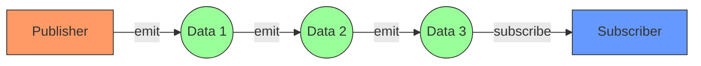
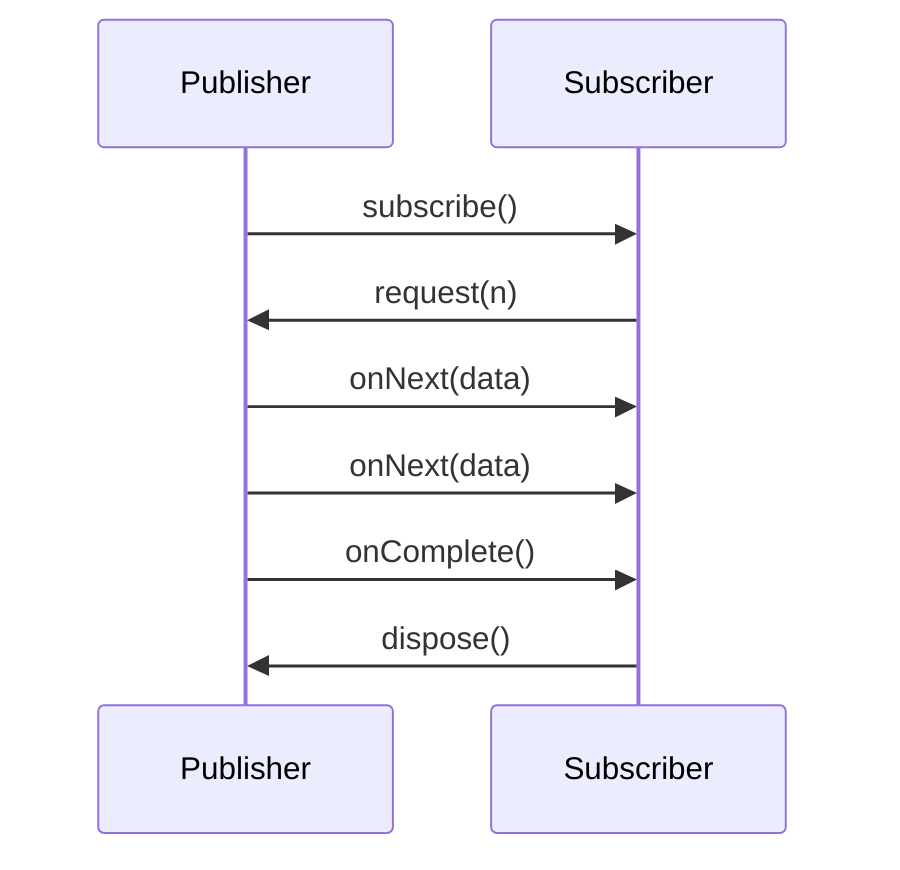
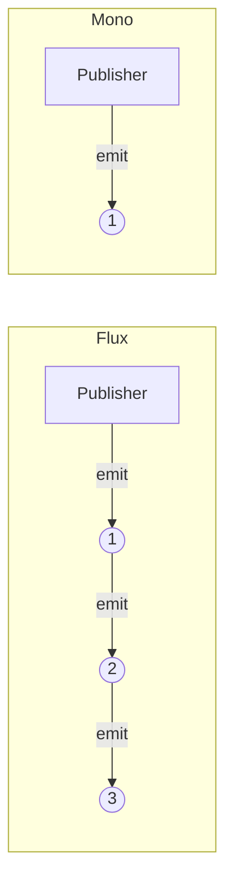

# Reactor 용어 정의 📘

Reactor에서 사용되는 주요 용어와 개념들을 정리합니다. 이 용어들은 Reactor를 학습하고 사용할 때 중요한 기초가 됩니다.

---

## 1. Publisher 📤
- 데이터를 **발행(방출)** 하는 역할.
- 데이터를 생산하거나 이벤트를 발생시키는 **생산자(Producer)** 역할을 담당.
- `Flux` 또는 `Mono`가 대표적인 Publisher의 구현체입니다.

---

## 2. Subscriber 📥
- 데이터를 **소비**하거나 이벤트를 **구독**하는 역할.
- `Publisher`의 데이터를 처리하거나 반응하는 **소비자(Consumer)** 역할을 담당.
- 데이터를 요청하거나 구독 해지 등의 작업을 수행합니다.

---

## 3. Emit 🚀
- `Publisher`가 데이터를 내보내는(방출하는) 행위를 뜻합니다.
- 예: Flux가 값을 발행하거나, 에러 또는 완료 신호를 방출.

---

## 4. Sequence 🔄
- `Publisher`가 **emit**하는 데이터의 **연속적인 흐름**을 정의한 것입니다.
- 연산자를 통해 데이터를 변환하거나 필터링하는 **Operator 체인**으로 구성됩니다.
- 데이터 흐름의 설계도라고 볼 수 있습니다.

---

## 5. Subscribe 📡
- `Subscriber`가 `Sequence`를 **구독**하는 행위를 뜻합니다.
- `Publisher`가 데이터를 방출하고, `Subscriber`가 그 데이터를 처리하게 되는 연결 과정입니다.

---

## 6. Dispose ❌
- `Subscriber`가 `Sequence` 구독을 **해지**하는 행위를 뜻합니다.
- 리소스를 정리하거나 더 이상 데이터 방출을 받지 않도록 중단할 수 있습니다.

---

> **Reactor의 주요 용어는 리액티브 스트림의 핵심 개념을 기반으로 설계되었으며, 각각의 역할과 동작을 이해하는 것이 중요합니다.**

---

## 용어에 대한 예제 코드 💻

```java
import reactor.core.publisher.Flux;

public class ReactorTerminologyExample {
    public static void main(String[] args) {
        // Publisher: 데이터를 방출
        Flux<String> publisher = Flux.just("A", "B", "C");

        // Subscriber: 데이터를 소비
        publisher.subscribe(
            data -> System.out.println("Subscriber received: " + data), // onNext
            error -> System.err.println("Error occurred: " + error),    // onError
            () -> System.out.println("Sequence Completed!")            // onComplete
        );

        // Dispose: 구독 해지 예제
        var disposable = publisher
            .doOnNext(data -> System.out.println("Processing: " + data))
            .subscribe();

        // 구독 해지
        disposable.dispose();
        System.out.println("Subscription disposed!");
    }
}

```

## 시각화로 보는 Reactor 용어 🎨


#### 데이터를 가공하며 방출하는 과정


### 데이터 흐름 다이어그램 📊



### Flux vs Mono 비교 🔄



---

> 📚 **참고 자료**  
> - [Reactor 공식 문서](https://projectreactor.io/)  
> - [Reactive Streams Specification](https://www.reactive-streams.org/)  
